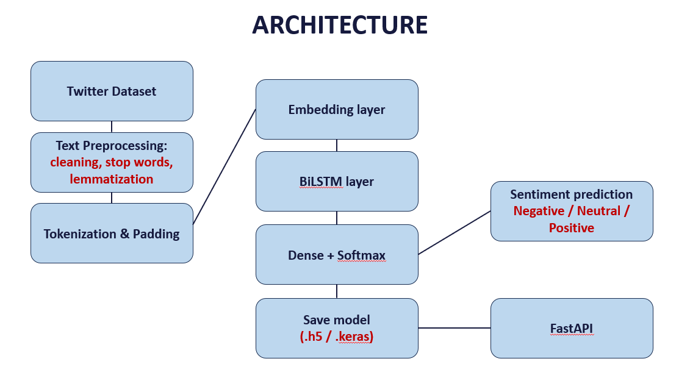
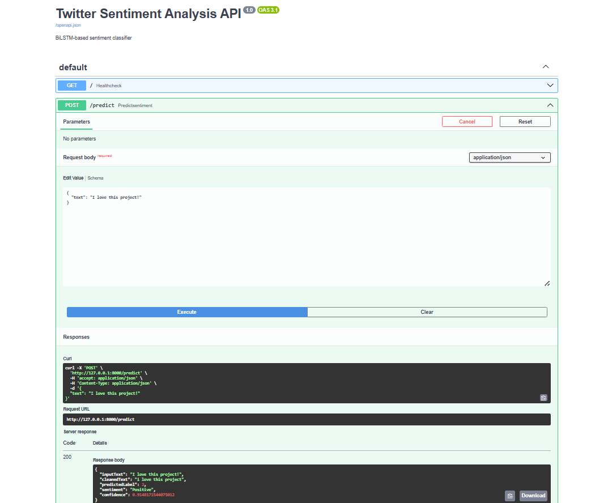

# 🐦 Twitter Sentiment Analysis using BiLSTM & FastAPI


---

## 📌 Project Overview

This project implements an end-to-end **Twitter Sentiment Analysis system** using:

- 🧠 Bidirectional LSTM (BiLSTM)
- 📊 NLP preprocessing
- ⚖️ Class imbalance handling
- 🚀 FastAPI deployment

The system classifies tweets into:

- Negative
- Neutral
- Positive

---

## 🏗️ System Architecture

<p align="center">
  
</p>

This architecture shows:

- Data preprocessing pipeline  
- Tokenization & padding  
- BiLSTM deep learning model  
- Model saving  
- FastAPI deployment for real-time inference  

---

## 🔄 Workflow

1. Dataset loading  
2. Text preprocessing  
3. Label encoding  
4. Train-test split  
5. Tokenization & padding  
6. BiLSTM model training  
7. Evaluation  
8. Model saving  
9. FastAPI deployment  

---

## 🧹 Text Preprocessing

- Lowercasing  
- URL removal  
- Mention & hashtag removal  
- Special character removal  
- Stopword removal  
- Lemmatization  

---

## 🧠 Model Architecture

- Embedding Layer  
- Bidirectional LSTM  
- Dropout layers  
- Dense + Softmax output  

Loss Function: `sparse_categorical_crossentropy`  
Optimizer: `Adam`

---

## 📊 Model Performance

| Metric | Score |
|--------|--------|
| Accuracy | ~69% |
| Macro F1 | 0.69 |
| Weighted F1 | 0.69 |

- Positive sentiment predicted best  
- Neutral class most challenging  
- Balanced performance across classes  

---

## 🚀 FastAPI Deployment

The trained model is deployed using **FastAPI**.

### 🖥️ Swagger UI Preview

<p align="center">
  
</p>

### ▶️ Run the API

```bash
cd Api
uvicorn app:app --reload
```

Open in browser:

```
http://127.0.0.1:8000/docs
```

### 📥 Example API Request

```json
{
  "text": "I love this project!"
}
```

---

## 📁 Project Structure

```
Twitter-Sentiment-Analysis-using-NLP/
app.py
dataLoader.py
preprocessing.py
tokenizerUtils.py
modelBuilder.py
trainer.py
evaluator.py
saveUtils.py
main.py
```

---

## 🔮 Future Improvements

- Pretrained embeddings (GloVe, FastText)  
- Transformer models (BERT)  
- Cloud deployment  
- Frontend UI integration  

---

## 👩‍💻 Author

Nighitha T. N.

---

⭐ If you found this project useful, consider giving it a star!
